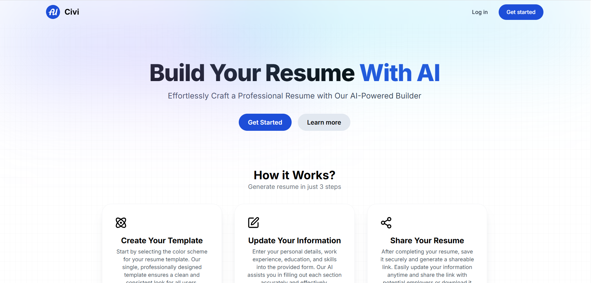
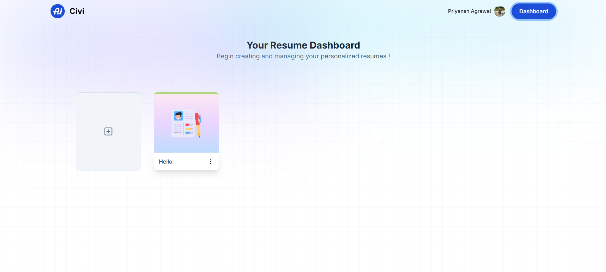
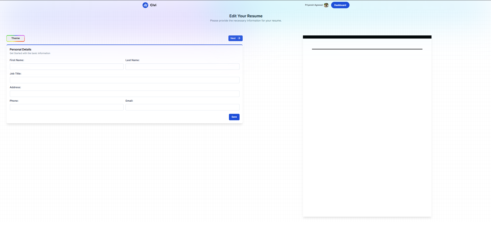
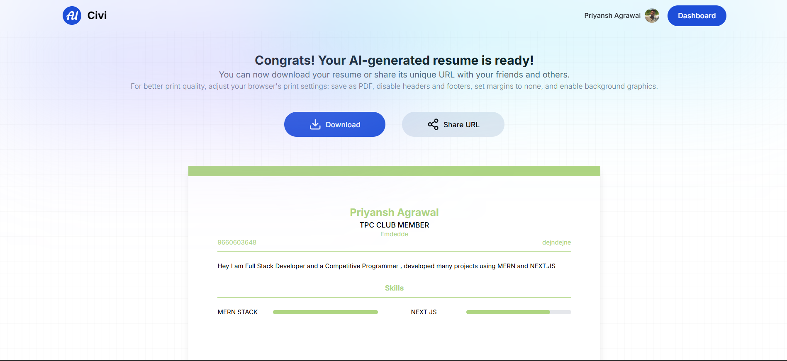

# Civi

**Civi** is an AI-powered resume builder designed to help professionals, students, and job seekers create polished, customized resumes effortlessly. Leveraging modern AI and web technologies, Civi ensures that your resume not only looks professional but also highlights your skills and achievements effectively.  

Whether you are a fresher, experienced professional, or switching careers, Civi makes resume creation intuitive, fast, and visually appealing.  

---

## ✨ Features

- **AI-Powered Resume Generation:**  
  Generate personalized, professional resumes with AI suggestions.  

- **User Authentication:**  
  Secure login and registration system powered by **Clerk**.  

- **Real-Time Preview:**  
  See live updates while filling in your resume.  

- **Easy Customization:**  
  Manage sections like experience, education, skills, and projects effortlessly.  

- **Save and Share:**  
  Save your resume and share a link with recruiters or employers.  

- **Fully Responsive:**  
  Works seamlessly across desktops, tablets, and mobile devices.  

---

## ⚙️ Tech Stack

### **Frontend**
- **Next.js 14.2.15:** Server-side rendering and static site generation for high performance.  
- **React 18:** Dynamic and responsive UI components.  
- **TailwindCSS + tailwind-merge + tailwindcss-animate:** Utility-first CSS for easy styling and responsiveness.  

### **Authentication**
- **Clerk:** Secure authentication and user management.  

### **AI Integration**
- **Gemini API / @google/generative-ai:** AI-powered resume content generation.  

### **UI Components & Interactivity**
- **Radix UI:** Accessible and customizable components like dialogs, popovers, toasts, and dropdowns.  
- **Lucide-React:** Lightweight icon library.  
- **Draft.js & React-Quill:** Rich text editors for detailed, formatted resumes.  
- **React-Hook-Form & Zod:** Efficient form handling and validation.  

### **Backend**
- **Node.js:** Fast, scalable server environment.  
- **MongoDB & Mongoose:** Document-based database for storing user profiles and resumes.  

### **Other Utilities**
- **UUID:** Unique identifiers for user data and resumes.  
- **React-Web-Share:** Easy sharing of resumes.  
- **Next-NProgress-Bar:** Smooth progress indicator for page transitions.  

---

## 📌 What the Application Does

Civi empowers users to **create, edit, and share professional resumes** in minutes. By combining **AI-powered content generation**, **real-time editing**, and **beautiful, customizable templates**, it takes the hassle out of resume creation.  

Key benefits:  
- Saves hours compared to manually creating a resume.  
- Highlights your experience and skills effectively using AI suggestions.  
- Provides a professional, modern look that appeals to recruiters.  
- Securely stores resumes with account-based management.  

Civi is more than just a resume builder — it’s your personal AI-powered career assistant.  

---

## 🖼 Screenshots

### Home Page
  
### Dashboard Page
  

### Resume Editor
  

### Preview & Share
  

---

## 🌐 Live Demo

[https://civi-ai.netlify.app/](#)
---

## 💡 Why Civi Stands Out

- AI-generated content tailored to your profile.  
- Real-time preview ensures you see exactly how your resume will look.  
- Fully customizable and mobile-friendly interface.  
- Secure user management and sharing options.  

---
With love from [Priyansh](https://github.com/priyansh7124)
